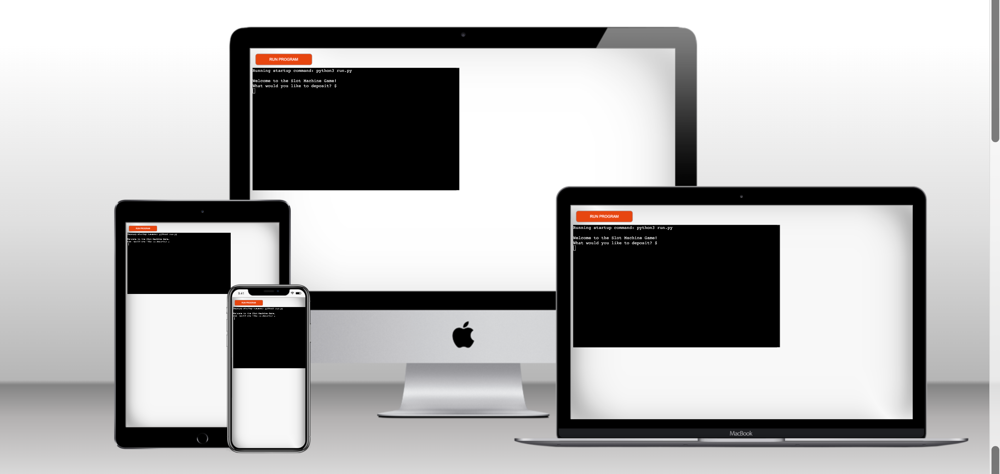
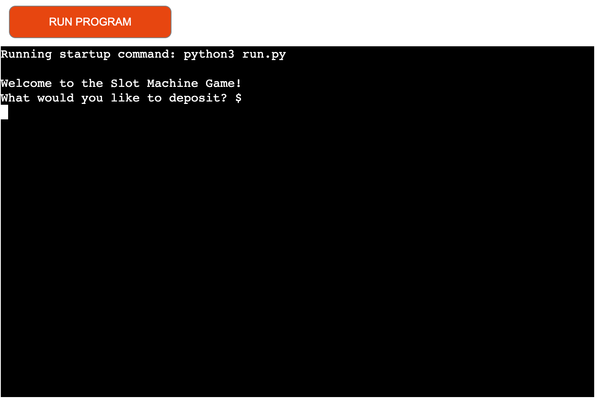
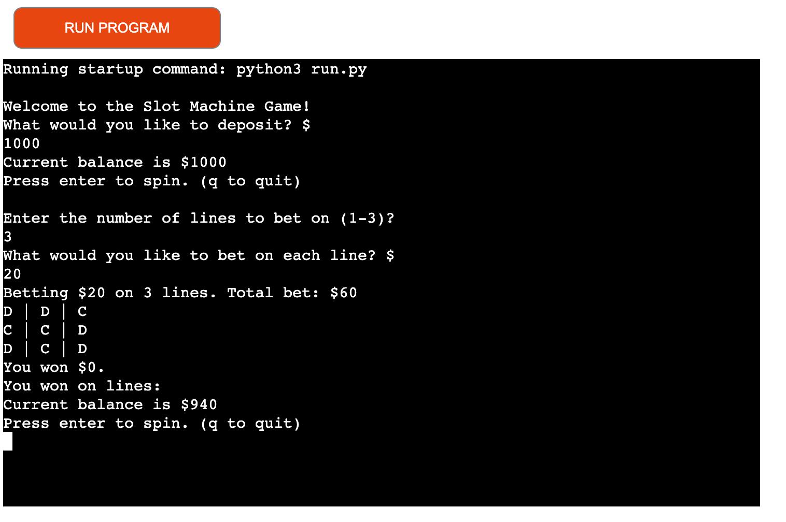
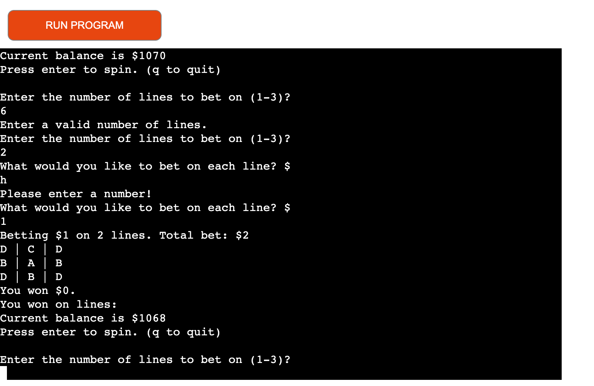
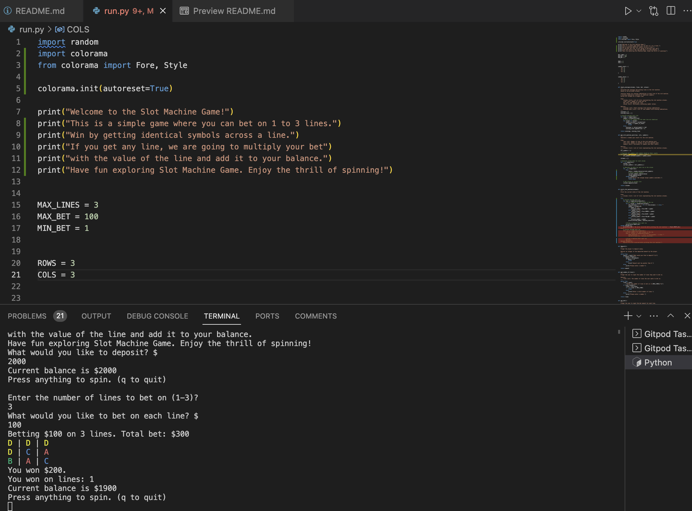

# Slot Machine Game

Welcome to the Slot Machine Game! This is a simple text-based game where players can bet on lines and try their luck at the slot machine. Have fun exploring the features of the Slot Machine Game and enjoy the thrill of spinning the virtual reels! 

Here is live version of my project! [Here](https://slott-machine-83a907620c24.herokuapp.com/)

## Table of Contents

- [How to Play](#how-to-play)
- [Features](#features)
- [Data Model](#data-model)
- [Testing](#testing)
- [Bugs and Known Issues](#bugs-and-known-issues)
- [Deploying This Project](#deploying-this-project)
- [Prerequisites and Deployment](#prerequisites-and-deployment)
- [Credits](#credits)
- [Acknowledgements](#acknowledgements)

## How to Play

1. **Deposit Money:**
   - When you start the game, you'll be prompted to deposit an amount of money.
   - Enter a positive integer greater than 0 to deposit funds into your balance.

2. **Place Your Bets:**
   - You'll be asked to choose the number of lines you want to bet on.
   - Enter a number between 1 and 3 to select the number of lines.

3. **Bet Amount:**
   - Enter the amount you want to bet on each line.
   - The bet amount must be between $1 and $100.

4. **Spin the Slot Machine:**
   - After placing your bets, the game will simulate a spin of the slot machine.
   - The results of the spin will be displayed, showing the symbols on each line.

5. **Check Winnings:**
   - The game will calculate your winnings based on the symbols' combinations.
   - If you win, the amount you win will be added to your balance.

6. **Repeat or Quit:**
   - You can choose to continue playing or quit the game.
   - Press Enter to spin again, or type "q" to quit.

7. **Ending the Game:**
   - When you're done playing, you can exit the game by typing "q" when prompted to spin.

## Features

- **Realistic Slot Machine Simulation:** Experience the excitement of a classic slot machine game with a realistic simulation of spinning reels and symbol combinations.

- **Dynamic Betting:** Choose the number of lines you want to bet on and the amount you want to bet per line, allowing for customizable gameplay.

- **Symbol Combinations:** The game checks for winning combinations across all columns on a single line, and calculates your winnings based on symbol values.

- **Interactive Interface:** The game provides an interactive interface with clear prompts and instructions for each step, making it easy for players to participate.

- **Balance Management:** Players start with a balance and can continue playing until they decide to quit or their balance runs out.

- **User-Friendly:** The game is designed to be user-friendly, guiding players through the steps of placing bets, spinning the slot machine, and checking their winnings.

## Data Model

The Slot Machine Game utilizes the following data structures and functions:

### `symbol_count` and `symbol_value`

These dictionaries define the symbols used in the game and their associated counts and values. These values play a crucial role in determining winnings based on symbol combinations.

### `get_slot_machine_spin`

This function generates a random spin result for the slot machine. It accepts the number of rows, columns, and symbols as inputs and returns a list of lists representing the slot machine columns.

### `check_winnings`

The `check_winnings` function calculates the winnings and identifies winning lines in the slot machine based on the provided columns. It evaluates each line for winning combinations consisting of identical symbols across all columns.

### `print_slot_machine`

This function prints the current state of the slot machine columns. It takes a list of lists representing the slot machine columns as input and displays the symbols row by row, column by column.

### `deposit`, `get_number_of_lines`, and `get_bet`

These functions are responsible for gathering player input regarding deposit amount, number of lines to bet on, and bet amount per line, respectively. They ensure valid input from the player and return the appropriate values.

### `spin`

The `spin` function simulates a round of the game. It prompts the player to place a bet, evaluates if the bet is within the available balance, and then generates a spin result. It calculates winnings, displays the outcome, and updates the player's balance.

### `main`

The `main` function orchestrates the overall flow of the game. It handles player interaction, balance management, and repetitive gameplay until the player decides to quit.

## Testing

### Functional Testing

Functional testing focused on testing the game's core functionality, such as placing bets, spinning the slot machine, and calculating winnings. This testing was essential to ensure that the game behaves as expected during gameplay.

### Testing Colorful Output with Colorama

The Slot Machine Game features colorful output using the `colorama` library to enhance the gaming experience. While unit tests do not capture colored output directly, you can test the game's color features in your IDE's console. Here's how:

1. Run the game in your IDE or terminal.
2. Observe the colorful symbols displayed in the slot machine.
3. Confirm that symbols "A," "B," "C," and "D" are displayed in their respective colors: red, green, blue, and yellow.

### Manual Testing

The game was manually tested by playing various rounds, placing different bets, and observing the balance, winnings, and outcomes. This hands-on testing helped uncover any issues that might not be covered by automated testing.

| Test Case ID | Description                                          | Steps to Reproduce                                  | Expected Outcome                              | Actual Outcome                              | Status |
|--------------|------------------------------------------------------|------------------------------------------------------|----------------------------------------------|--------------------------------------------|--------|
| MT001        | Start the game and make a deposit                   | 1. Run the game.                                   | Prompt for deposit input, display balance   | Prompted for deposit, displayed balance  | Passed |
| MT002        | Input invalid deposit amount                        | 1. Make a deposit with a negative amount.         | Display error message                       | Displayed error message                   | Passed |
| MT003        | Input valid deposit amount                          | 1. Make a deposit with a positive amount.         | Update balance and proceed to betting      | Balance updated, proceeded to betting    | Passed |
| MT004        | Input number of lines to bet on                     | 1. Start the game.                                | Prompt for number of lines input             | Prompted for lines input                 | Passed |
| MT005        | Input invalid number of lines                       | 1. Enter a non-numeric value.                    | Display error message                       | Displayed error message                   | Passed |
| MT006        | Input valid number of lines                         | 1. Enter a number between 1 and 3.               | Proceed to bet amount input                 | Proceeded to bet input                    | Passed |
| MT007        | Input bet amount for each line                      | 1. Enter a valid bet amount for each line.       | Display slot machine result and winnings    | Displayed result and winnings             | Passed |
| MT008        | Input invalid bet amount                            | 1. Enter a non-numeric value.                    | Display error message                       | Displayed error message                   | Passed |
| MT009        | Spin and win with identical symbols                 | 1. Enter a valid bet amount.                     | Calculate winnings and update balance      | Updated balance and winnings             | Passed |
| MT010        | Spin and win on multiple lines                      | 1. Enter a valid bet amount.                     | Calculate winnings for each line            | Updated balance and winnings             | Passed |
| MT011        | Spin and lose                                       | 1. Enter a valid bet amount.                     | Update balance and show losses              | Updated balance and displayed losses     | Passed |
| MT012        | Quit the game with "q" input                        | 1. Spin the reels and wait for result.           | Display final balance                       | Displayed final balance                  | Passed |
| MT013        | Quit the game with other input                      | 1. Enter any input other than "q".              | Continue the game                          | Continued the game                       | Passed |

Feel free to expand this table with more detailed steps, expected outcomes, and actual outcomes as you perform manual testing on your slot machine game. This table will help you ensure that your game functions as intended and identify any issues that need to be addressed.

### Player Experience Testing

User testing was conducted to evaluate the overall player experience. A different group of friends played the game, providing feedback on user interface clarity, ease of use, and overall enjoyment. This feedback was instrumental in refining the user interaction aspects of the game.

### Error Handling and Edge Cases

- **Deposit Amount:** When the player is prompted to deposit money, the game ensures that a valid positive integer is entered. If the player enters a non-numeric value or a negative number, the game displays an error message and prompts the player to enter a valid amount.

- **Number of Lines:** When the player is prompted to input the number of lines they want to bet on, the game validates that the entered value is within the allowed range (1 to 3). If the input is not a valid integer or is outside the allowed range, an error message is displayed, and the player is prompted to enter a valid value.

- **Bet Amount:** When the player is prompted to input the bet amount for each line, the game validates that the entered value is within the allowed range (MIN_BET to MAX_BET). Similar to the previous cases, if the input is not a valid integer or is outside the allowed range, an error message is displayed, and the player is prompted to enter a valid value.

Extensive testing was conducted to identify and address potential errors, edge cases, and exceptional scenarios. This involved testing for cases such as insufficient balance for a bet, input validation for numeric values, and handling unexpected input gracefully.

## Bugs and Known Issues

Throughout the development and testing process, i identified and resolved several bugs and known issues in the Slot Machine Game. Below is a list of these issues along with their current status:

### Bug 1: Insufficient Balance Check

**Description:** There was a bug in the `spin` function where the game did not handle insufficient balance correctly. Players could place bets even if their balance was lower than the total bet amount.

**Status:** Resolved: Players are now prevented from placing bets that exceed their available balance.

### Bug 2: Trailing Whitespace

**Description:** The code contained trailing whitespace in some lines, leading to formatting inconsistencies.

**Status:** Resolved: Trailing whitespace has been removed from relevant lines.

### Bug 3: Input Validation

**Description:** The input validation for bet amounts did not handle non-numeric input gracefully, leading to unexpected behavior.

**Status:** Resolved: Improved input validation now prompts users to enter valid numeric values.

### Known Issue: Winning Lines Display

**Description:** In some cases, the display of winning line numbers in the output does not align properly with the game grid.

**Status:** Under investigation. This issue is being actively addressed and will be resolved in an upcoming release.

### Known Issue: Edge Case Testing

**Description:** Some rare edge cases involving specific symbol configurations have not been fully tested for accuracy.

**Status:** Ongoing. Additional testing is being conducted to identify and address any potential edge cases.

## Deploying This Project

Follow these steps to deploy your Slot Machine Game on Heroku:

1. **Log in to Heroku or Create an Account:**
   - If you don't have a Heroku account, sign up on the Heroku website.
   - Log in to your Heroku account.

2. **Create a New App:**
   - On the Heroku dashboard, click the "New" button in the top right corner.
   - From the drop-down menu, select "Create New App."
   - Enter a unique app name.
   - Choose your preferred region.
   - Click the "Create App" button.

3. **Configure Environment Variables:**
   - On the Deploy tab of your app's page, navigate to the Settings tab.
   - Scroll down to the "Config Vars" section.
   - Click "Reveal Config Vars."
   - Add the following environment variables:
     - Key: `port`, Value: `8000`
   - Save the added variables.

4. **Set Up Buildpacks:**
   - Scroll to the Buildpack section on the same page.
   - Click "Add Buildpack" and select "Python." Save changes.
   - Repeat the above step to add "node.js" as well.
   - Ensure the order of buildpacks is correct (Python before node.js).

5. **Connect to GitHub and Deploy:**
   - Go to the Deploy tab.
   - Choose GitHub as the deployment method.
   - Confirm the connection to your GitHub account.
   - Search for your repository's name and click the "Connect" button.
   - Scroll to the bottom of the deploy page.
   - Choose your preferred deployment method:
     - "Enable Automatic Deploys" for automatic deployment on GitHub updates.
     - "Deploy Branch" to manually deploy from a specific branch.

6. **Access Your Deployed App:**
   - Once the deployment process is complete, you'll find a link to your live app at the top of the Heroku dashboard.
   - Click the link to open your Slot Machine Game in a web browser.

**Important Notes:**
- Ensure your project includes a `requirements.txt` file that lists all dependencies.
- Include a `Procfile` in your project's root directory to specify the command Heroku should use to run your app.

That's it! Your Slot Machine Game is now accessible to the world via Heroku.

### Important Notes:

- Make sure you have a `requirements.txt` file in your project directory. This file lists all the dependencies that Heroku needs to run your game.
- You'll also need a `Procfile` in your project directory. This tells Heroku what command to use to run your application.

Keep in mind that deploying on Heroku might have some costs depending on your app's usage and the Heroku plan you choose. If you need more detailed instructions, you can always check out the [Heroku Dev Center](https://devcenter.heroku.com/).

That's it! My Slot Machine Game is now accessible to everyone, and it's been an exciting journey from development to deployment.

## Credits

The Slot Machine Game was developed by [Saikou Gassama].

### Acknowledgements

- [OpenAI](https://www.openai.com/) for their GPT-3 technology, which assisted in generating code examples and explanations for this project.
- [Python](https://www.python.org/) for the programming language used to build the game.
- [Heroku](https://www.heroku.com/) for providing a platform to deploy and host the game.
- [GitPod](https://www.gitpod.io/) for offering an online development environment.
- [Stack Overflow](https://stackoverflow.com/) and other online programming communities for providing solutions to coding challenges.
- [GitHub](https://github.com/) for version control and hosting the project repository.
- [Code Institute](https://learn.codeinstitute.net/dashboard) I want to express my gratitude to Code Institute for providing valuable education and resources that helped me develop and deploy this project.

If you found this project helpful or interesting, consider giving it a star on GitHub or sharing it with others!

## License
This project is licensed under the MIT License.

Feel free to modify and customize it according to your needs. Happy playing!

Have fun playing the Slot Machine Game and best of luck with your deployment on Heroku using Gitpod!

Certainly! Here's an example table that outlines the testing scenarios for your slot machine game:

| Test Case ID | Description                                           | Expected Outcome                                | Actual Outcome    | Status |
|--------------|-------------------------------------------------------|--------------------------------------------------|-------------------|--------|
| TC001        | Start the game and make a deposit                    | Prompt for deposit input, display balance       | ...               | ...    |
| TC002        | Input invalid deposit amount                         | Display error message                           | ...               | ...    |
| TC003        | Input valid deposit amount                           | Update balance and proceed to betting            | ...               | ...    |
| TC004        | Input number of lines to bet on                      | Display prompt for number of lines              | ...               | ...    |
| TC005        | Input invalid number of lines                        | Display error message                           | ...               | ...    |
| TC006        | Input valid number of lines                          | Proceed to bet amount input                     | ...               | ...    |
| TC007        | Input bet amount for each line                       | Display prompt for bet amount                   | ...               | ...    |
| TC008        | Input invalid bet amount                             | Display error message                           | ...               | ...    |
| TC009        | Input valid bet amount                               | Display slot machine result and winnings        | ...               | ...    |
| TC010        | Spin and win with identical symbols                  | Calculate winnings and update balance          | ...               | ...    |
| TC011        | Spin and win on multiple lines                       | Calculate winnings for each line and update balance | ...               | ...    |
| TC012        | Spin and lose                                        | Update balance and show losses                  | ...               | ...    |
| TC013        | Quit the game with "q" input                         | Display final balance                           | ...               | ...    |
| TC014        | Quit the game with other input                       | Continue the game                              | ...               | ...    |

You can continue to expand this table to include more test cases or add additional columns for notes, test results, and any bugs encountered during testing. This table will help you keep track of your testing process and ensure that your game works as expected under various scenarios.